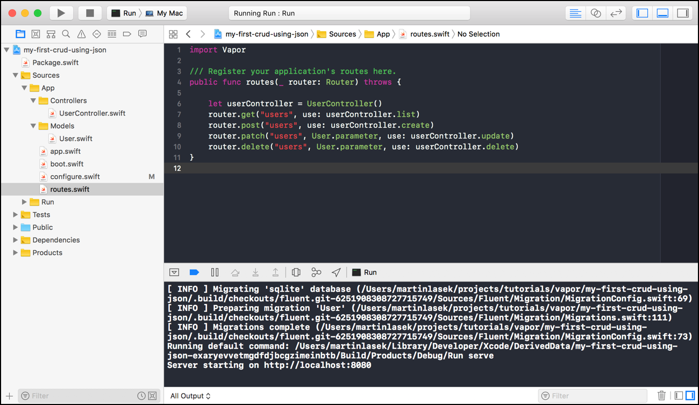

  <h2>My First CRUD using JSON 👨🏼‍💻 </h2>
  <h3>Tutorial to build this project</h3>
  <h4><a href="https://medium.com/@martinlasek/tutorial-write-a-crud-api-using-json-c1edb1439d8a">How to write CRUD using JSON</a></h4>
   
  

## Community 🚀
Join the awesome and welcoming Vapor community in <a href="http://vapor.team/"><b>Discord!</b></a>
